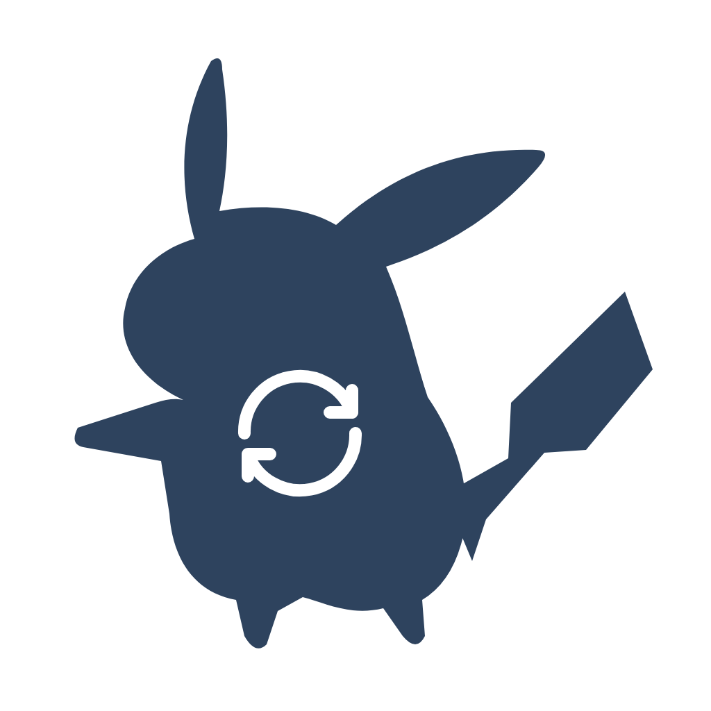

  
  <h1>Syncachu</h1>
  
<strong>Your photos. Your videos. Your Azure storage.</strong>

  
Private photo and video backup for iOS and Android, with resumable uploads and an account-scoped cloud gallery.

  

    
    
    
  

  

    <a href="docs/README.md">Documentation</a> &middot;
    <a href="docs/getting-started.md">Getting started</a> &middot;
    <a href="infra/README.md">Deploy</a> &middot;
    <a href="docs/security.md">Security model</a>
  

---

Syncachu backs up original media from your phone to a private Azure Blob Storage
account that you operate. Sign in with Google, choose individual files or sync
your accessible library, and browse finalized backups in the app.

Built with **Expo, React Native, and TypeScript**, backed by **Azure Functions**
and native **Kotlin / Swift** backup workers.

> [!IMPORTANT]
> Syncachu is currently an **invite-only private beta**, not a managed backup
> service. Running your own instance requires Azure and Google OAuth configuration.
> Keep a second, independent backup of irreplaceable media.

## What Syncachu does

| Capability | How it works |
| --- | --- |
| **Original-quality backup** | Upload original photo and video bytes; the API verifies SHA-256 and file size before publishing. |
| **Resumable transfers** | A shared upload queue tracks block progress and supports retry and cancellation. |
| **Background uploads** | Native workers continue already-queued backups when you switch apps or lock the screen, subject to OS restrictions. |
| **Wi-Fi by default** | Cellular uploads require explicit opt-in; native workers also enforce the network policy. |
| **Per-account libraries** | Google-authenticated accounts have separate storage namespaces and galleries; content deduplication is per user. |
| **Visible storage usage** | View used, reserved, and available capacity against an instance-wide quota. |
| **Device originals stay yours** | Backup, cancellation, and sign-out never delete media from the device library. |

## From phone to private storage

1. **Choose what to back up.** Use **Choose files** or **Sync all**. Optional
   auto-sync discovers new accessible media while the app is active.
2. **Transfer directly to Azure.** The API reserves capacity and issues temporary,
   blob-scoped upload URLs. The phone uploads originals and JPEG thumbnails.
3. **Verify, then browse.** The API independently verifies the original before
   publishing it. The gallery uses short-lived links to private media.

Keep the app open until the library scan finishes: media that has not been
discovered is not yet queued. See [background backup](docs/background-backup.md)
for the Android and iOS behavior, network rules, and recovery guidance.

## Start here

| I want to... | Guide |
| --- | --- |
| Run the app and API for development | [Getting started](docs/getting-started.md) |
| Deploy an invite-only Azure instance | [Deployment runbook](infra/README.md) |
| Understand the upload flow and API routes | [Architecture](docs/architecture.md) |
| Review access, credentials, and privacy boundaries | [Security model](docs/security.md) |
| Configure capacity or investigate reservations | [Storage and quota](docs/storage-and-quota.md) |
| Work on the code or prepare a native release | [Development and release checks](docs/development.md) |

The [documentation index](docs/README.md) connects the setup, reference, and
operations guides.

## Project status

The current release targets small, explicitly approved groups using internal
Android and iOS builds. These boundaries are part of the current product:

| Area | Current behavior |
| --- | --- |
| Access | Verified Google email addresses on a server-side allowlist. |
| Storage allowance | **1 TB decimal total per instance** by default, shared across approved accounts; not a billing cap. |
| File limits | Originals up to **2 GiB**; generated JPEG thumbnails up to **1 MiB**. |
| Background discovery | New media is discovered while the app is active, not continuously while closed. Queued transfers can continue natively. |
| Encryption | HTTPS in transit and Azure encryption at rest; **not end-to-end encrypted**. |
| Availability | Native development and internal beta builds. Expo Go and browser backup are not supported. |

Restore/export, cloud deletion, deletion of backed-up device originals, account
recovery UX, and production abuse/rate limits are not currently included.
Background work depends on OS scheduling, connectivity, available device media,
and credential lifetime; force-stopping the app stops backup.

## Repository

| Path | Responsibility |
| --- | --- |
| [`mobile/`](mobile/) | Expo application, gallery, network policy, and resumable upload queue. |
| [`mobile/modules/background-backup/`](mobile/modules/background-backup/) | Local Expo module with Android foreground-service and iOS background-transfer workers. |
| [`api/`](api/) | Google-authenticated Azure Functions API, private blob access, and quota accounting. |
| [`infra/`](infra/) | Bicep provisioning and the protected GitHub Actions / OIDC deployment runbook. |
| [`docs/`](docs/README.md) | Setup, architecture, security, background behavior, and release guidance. |

---

  <a href="docs/getting-started.md">Set up a development environment</a> &middot;
  <a href="infra/README.md">Deploy a private instance</a>

