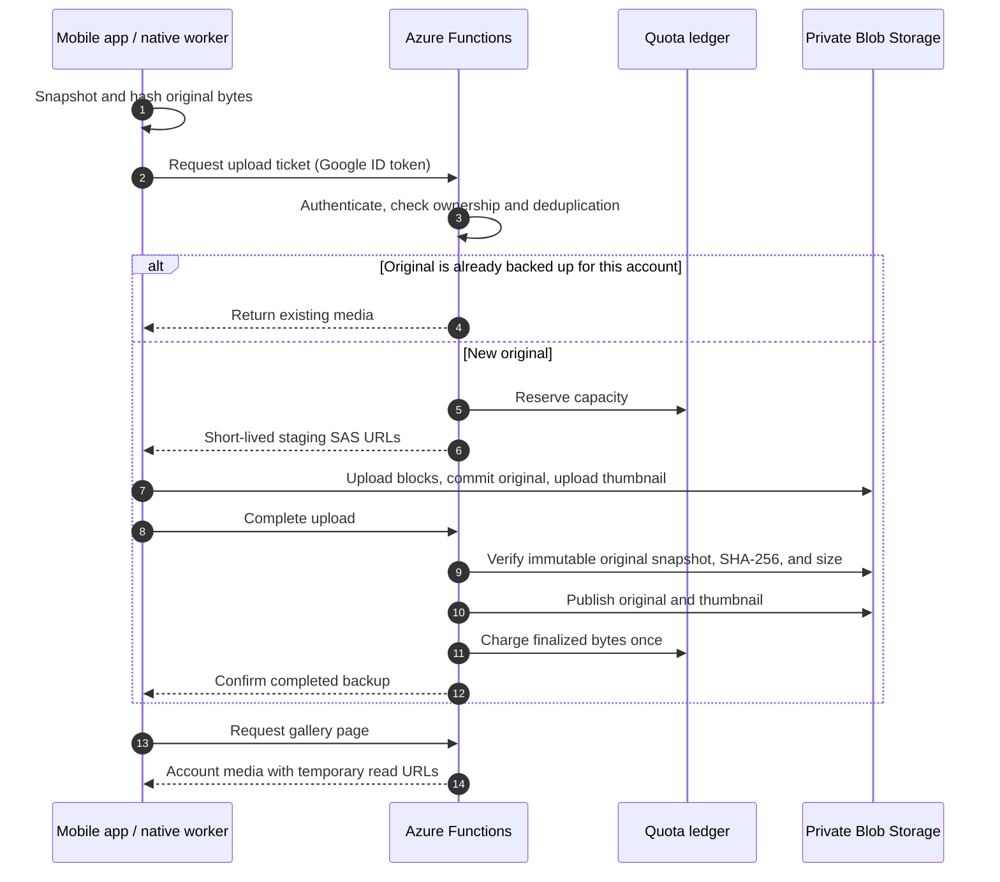

[Syncachu](../README.md) / [Documentation](README.md) / Architecture

# Architecture

Syncachu separates the mobile backup queue, the authenticated control API, and
private Azure storage. Original media transfers directly from the phone to Blob
Storage; the API authorizes each upload and verifies it before publication.

**On this page:** [Components](#components) | [Upload lifecycle](#upload-lifecycle) |
[API routes](#api-routes) | [Code map](#code-map)

## Components

| Component | Responsibility |
| --- | --- |
| Expo / React Native app | Google sign-in, media selection and discovery, visible queue, network preferences, and gallery. |
| Native backup module | Android foreground-service and iOS background-transfer execution, private working snapshots, and durable checkpoints. |
| Azure Functions API | Token verification, allowlist enforcement, account ownership, upload tickets, byte verification, and gallery access. |
| Azure Blob Storage | Private staging objects, finalized originals and thumbnails, and catalog/ticket metadata. |
| Azure Table Storage | Atomic instance-wide quota ledger and upload reservations. |
| Separate host storage | Functions runtime and deployment packages, not the user's media library. |

## Upload lifecycle

Blocks are deterministic so interrupted transfers can resume. Google tokens go
only to the API, never to SAS URLs. The server independently verifies the file
rather than trusting the hash supplied by the phone.

Publication and quota accounting span storage operations, not one cross-service
transaction. Retries and idempotent accounting handle interrupted completion;
reservations that have started publishing are retained conservatively. See
[reservation behavior](storage-and-quota.md#reservations-and-finalization) before
attempting to recover capacity.

The foreground queue and native workers reconcile checkpoints and completion
receipts when the app reopens. Native execution does not provide continuous
photo-library discovery; see [background backup](background-backup.md).

## API routes

All routes below except health require a Google ID token using
`Authorization: Bearer <id-token>`. The email must be verified and approved by the
server allowlist. Ownership comes from the verified account, not a client-supplied
storage namespace.

| Method | Route | Purpose |
| --- | --- | --- |
| `POST` | `/api/uploads` | Check the current user's hash or create a staging upload ticket. |
| `POST` | `/api/uploads/{uploadId}/renew` | Renew scoped URLs for an owned upload. |
| `POST` | `/api/uploads/{uploadId}/complete` | Verify and finalize uploaded media. |
| `GET` | `/api/media?cursor=...` | Page through the current user's finalized media. |
| `GET` | `/api/usage` | Read shared instance used/reserved/available bytes and its quota. |
| `GET` | `/api/health` | Unauthenticated liveness response; does not verify storage, quota readiness, or OAuth configuration. |

> [!NOTE]
> Azure Functions routes use `authLevel: "anonymous"` because Google bearer-token
> authentication is enforced by the application's request handler. This does not
> make media or usage endpoints public.

The reservation-expiry timer runs every 15 minutes. API handlers and request
types are the source of truth for payload validation; this page is a route and
architecture overview, not a versioned API specification.

## Code map

| Entry point | Read it for |
| --- | --- |
| [`mobile/App.tsx`](../mobile/App.tsx) | App screens and user interactions. |
| [`mobile/src/engine.ts`](../mobile/src/engine.ts) | Foreground upload queue orchestration. |
| [`mobile/src/background.ts`](../mobile/src/background.ts) | Native backup integration and queue reconciliation. |
| [`mobile/modules/background-backup/`](../mobile/modules/background-backup/) | Kotlin and Swift workers. |
| [`api/src/functions.ts`](../api/src/functions.ts) | HTTP routes and reservation-expiry timer. |
| [`api/src/http.ts`](../api/src/http.ts) | Request handling and validation. |
| [`api/src/service.ts`](../api/src/service.ts) | Upload, completion, and gallery operations. |
| [`api/src/storage.ts`](../api/src/storage.ts) | Private blob operations and scoped SAS grants. |
| [`api/src/quota.ts`](../api/src/quota.ts) | Quota reservations and accounting. |
| [`infra/main.bicep`](../infra/main.bicep) | Azure resources, identities, roles, and runtime settings. |

---

[Documentation index](README.md) | [Security model](security.md) |
[Storage and quota](storage-and-quota.md)
